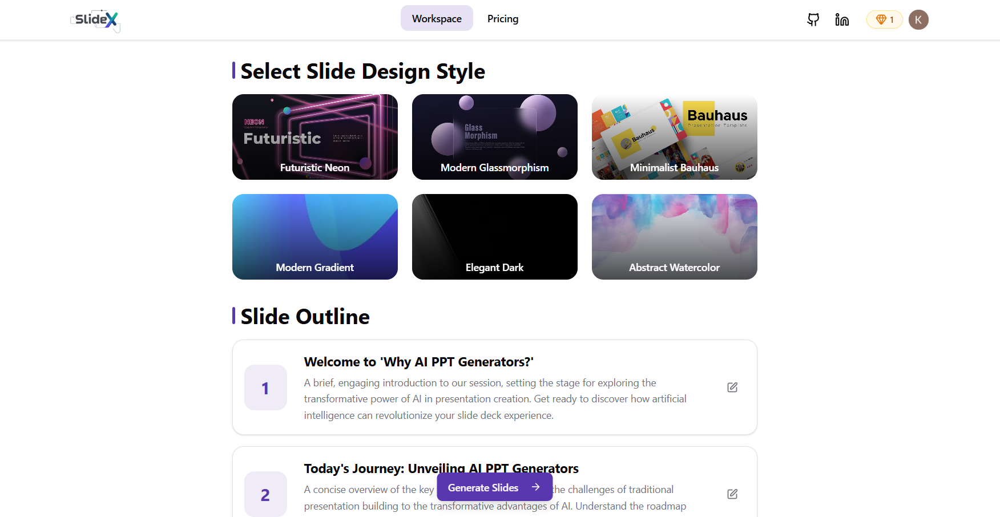

# SlideX - AI-Powered Presentation Generator

**SlideX** is a modern AI-based web application that allows users to create complete, visually appealing presentations with just a single prompt.  
It combines automation, intelligent content generation, and sleek design to save hours of manual work while maintaining professional quality.

[](https://reactjs.org/)
[](https://www.typescriptlang.org/)
[](https://vitejs.dev/)
[](https://tailwindcss.com/)
[](https://firebase.google.com/)

---

<div align="center">

<h3><strong>Access the Live Application</strong></h3>

<a href="https://slidex-nu.vercel.app/" target="_blank" style="text-decoration:none; font-size:16px; font-weight:600; color:#007acc;">
https://slidex-nu.vercel.app/
</a>

<p style="margin-top:8px;">Fully deployed — explore, generate, and design your presentations online.</p>

<hr style="width:60%; margin:25px auto; border:0.5px solid #e0e0e0;">

</div>

---

## Overview

**SlideX** provides a seamless experience for generating, editing, and managing presentations with AI.  
Built using **React 19**, **TypeScript**, and **Vite**, it integrates Google's **Gemini AI** for content generation and Firebase for real-time data handling.

<div align="center">
  
###  Watch the Demo Video

[](https://youtu.be/xgTlJS_-94A)

</div>

---

## Features

### Intelligent Automation

- Generate full presentations from short prompts or topic inputs
- AI outlines slides with relevant text and headings
- Automatically applies layout and design consistency

### Design & Editing

- Choose from multiple pre-built templates and color themes
- Intuitive visual editor for slide customization
- Export ready-to-present decks as PowerPoint files

### Account & Storage

- Secure user authentication with **Clerk**
- Cloud storage powered by **Firebase** for persistent access
- Credit-based freemium system for controlled AI usage

### Experience

- Modern and responsive UI/UX
- Optimized for desktop, tablet, and mobile
- Minimal, distraction-free interface built with **Radix UI** and **Tailwind CSS**

---

## Tech Stack

| Category             | Technology                 |
| -------------------- | -------------------------- |
| **Frontend**         | React 19, TypeScript, Vite |
| **Styling**          | Tailwind CSS, Radix UI     |
| **Routing**          | React Router v7            |
| **Authentication**   | Clerk                      |
| **Backend**          | Firebase (Firestore)       |
| **AI Engine**        | Google Gemini AI           |
| **State Management** | React Context API          |
| **Form Handling**    | React Hook Form, Zod       |

---

## Installation & Setup

### Prerequisites

- Node.js (v16 or later)
- npm or yarn package manager

### Steps

```bash
# Clone the repository
git clone <repository-url>
cd slidex

# Install dependencies
npm install
```

### Environment Variables

Create a `.env` file in the root directory and add:

```
VITE_CLERK_PUBLISHABLE_KEY=your_clerk_publishable_key
VITE_FIREBASE_API_KEY=your_firebase_api_key
```

### Development

```bash
# Start the development server
npm run dev

# Build for production
npm run build

# Preview the production build
npm run preview
```

The app will be available at `http://localhost:5173`.

---

## API Documentation

SlideX uses Firebase as its backend service. The application interacts with Firebase APIs for:

### Authentication

- User registration and login
- Session management with Clerk
- Secure access to user resources

### Data Management

- `projects` collection: Store presentation data
- `users` collection: Manage user profiles and credits
- Real-time data synchronization

### AI Integration

- Google Gemini API for content generation
- Live streaming for real-time slide creation
- Template-based design generation

---

## Contributing

Contributions are welcome! Here's how you can help:

1. Fork the repository
2. Create a feature branch (`git checkout -b feature/AmazingFeature`)
3. Commit your changes (`git commit -m 'Add some AmazingFeature'`)
4. Push to the branch (`git push origin feature/AmazingFeature`)
5. Open a Pull Request

Please ensure your code follows the existing style and includes appropriate tests.

---

## License

This project is licensed under the MIT License - see the [LICENSE](LICENSE) file for details.

---

## Support

- **Bug Reports**: [GitHub Issues](https://github.com/ks9128/slidex/issues)
- **Feature Requests**: [GitHub Discussions](https://github.com/ks9128/slidex/discussions)
- **Contact**: [@ks9128](https://github.com/ks9128)

---

**If you found this project helpful, please give it a star on GitHub!**

Made with ❤️ by Khalid Saifullah
